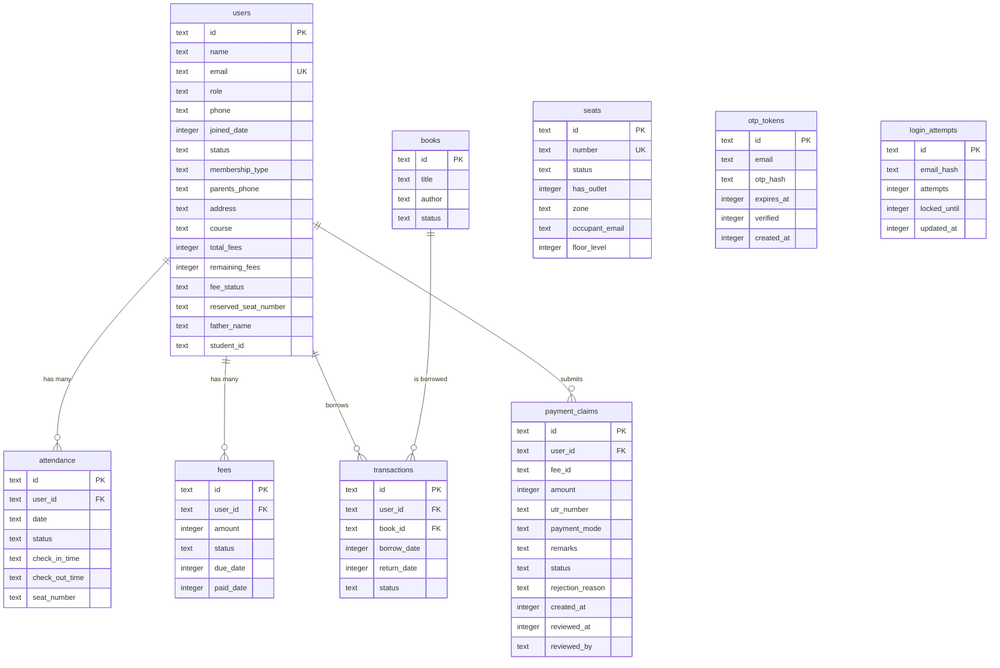

# Technical Requirements Document (TRD)
## Genius Library — White-Label Library Management Platform
**Version:** 2.0 (Production — reflects actual built system)
**Last Updated:** September 2026

---

## 1. Technology Stack (Actual Production)

| Layer | Technology | Purpose |
|---|---|---|
| **Framework** | Next.js 16.3 (App Router, TypeScript) | Server-rendered pages, API routes, React Server Components |
| **Styling** | Tailwind CSS v4 + Vanilla CSS | Utility-first styling with custom design system |
| **Hosting** | Cloudflare Pages | Global CDN, edge rendering, zero cold starts |
| **Edge Runtime** | `@opennextjs/cloudflare` + `@cloudflare/next-on-pages` | Adapts Next.js to run on Cloudflare Workers |
| **Primary Database** | Cloudflare D1 (SQLite at Edge) | Serverless SQL with zero-cost scaling |
| **ORM** | Drizzle ORM (SQLite dialect) | Type-safe database queries |
| **Authentication** | Supabase Auth | Google OAuth + Email/Password, JWT sessions |
| **Auth Client** | `@supabase/ssr` + `@supabase/supabase-js` | SSR-compatible Supabase client for Next.js |
| **File Storage** | Supabase Storage | Avatar uploads, profile images |
| **Email Service** | Resend API | Transactional fee receipt emails |
| **Bot Protection** | Cloudflare Turnstile | CAPTCHA on login forms |
| **QR Code** | `qrcode` + `jsqr` npm packages | Generate and scan QR codes for digital passes |
| **PDF Generation** | `jspdf` | Invoice/receipt PDF generation |
| **Icons** | Lucide React | Consistent icon library |
| **Fonts** | Google Fonts (Montserrat, Inter, Lora) | Brand typography |
| **PWA** | Service Worker + Web App Manifest | Installable app, offline caching |
| **Notifications** | Web Notifications API + BroadcastChannel | Native browser popups + cross-tab sync |
| **Package Manager** | pnpm | Fast, disk-efficient package management |

---

## 2. Monorepo Structure

```
genius-library/
├── apps/
│   └── web/                         # Next.js 16 Application
│       ├── public/
│       │   ├── manifest.json         # PWA manifest
│       │   ├── sw.js                 # Service Worker (push + caching)
│       │   ├── icons/                # PWA icons (192x192, 512x512)
│       │   └── images/               # Static images (hero banner, etc.)
│       ├── src/
│       │   ├── app/                  # Next.js App Router pages
│       │   │   ├── (public)/         # Public pages (landing, login, catalog)
│       │   │   │   ├── page.tsx      # Landing page (hero, features, pricing)
│       │   │   │   ├── layout.tsx    # Public layout (navbar, footer)
│       │   │   │   ├── catalog/      # Public book catalog
│       │   │   │   ├── login/        # Login page
│       │   │   │   ├── privacy/      # Privacy policy
│       │   │   │   ├── terms/        # Terms & conditions
│       │   │   │   ├── refund/       # Refund policy
│       │   │   │   └── rules/        # Library rules
│       │   │   ├── admin/            # Admin portal (AuthGuard: admin only)
│       │   │   │   ├── AdminClientLayout.tsx  # Admin shell (sidebar, header, nav)
│       │   │   │   ├── dashboard/    # Admin analytics dashboard
│       │   │   │   ├── students/     # Student CRUD management
│       │   │   │   ├── attendance/   # Attendance management
│       │   │   │   ├── books/        # Books inventory management
│       │   │   │   ├── seats/        # Seat management
│       │   │   │   ├── fees/         # Fee & fine management
│       │   │   │   ├── messages/     # Messaging center
│       │   │   │   ├── notifications/# Notification hub
│       │   │   │   ├── staff/        # Staff management
│       │   │   │   ├── reports/      # Reports page
│       │   │   │   ├── audit/        # Analytics & audit page
│       │   │   │   ├── analytics/    # Analytics page
│       │   │   │   └── scan/         # QR scanner page
│       │   │   ├── student/          # Student portal (AuthGuard: student only)
│       │   │   │   ├── StudentClientLayout.tsx  # Student shell
│       │   │   │   ├── dashboard/    # Student dashboard
│       │   │   │   ├── books/        # Book catalog + request
│       │   │   │   ├── attendance/   # Personal attendance
│       │   │   │   ├── fees/         # Fee status + payment claims
│       │   │   │   ├── pass/         # Digital QR entry pass
│       │   │   │   ├── messages/     # View messages from admin
│       │   │   │   ├── notifications/# Activity notifications
│       │   │   │   ├── profile/      # Profile settings
│       │   │   │   └── tasks/        # Task management
│       │   │   ├── staff/            # Staff portal (AuthGuard: staff only)
│       │   │   │   ├── StaffClientLayout.tsx  # Staff shell
│       │   │   │   ├── dashboard/    # Staff dashboard
│       │   │   │   ├── students/     # Student lookup
│       │   │   │   ├── attendance/   # Attendance management
│       │   │   │   ├── books/        # Book issue/return
│       │   │   │   ├── seats/        # Seat allocation
│       │   │   │   ├── fees/         # Fee collection
│       │   │   │   ├── messages/     # View messages
│       │   │   │   └── scan/         # QR scanner
│       │   │   ├── kiosk/            # Self-service kiosk mode
│       │   │   │   └── page.tsx      # Full-screen QR scanner
│       │   │   ├── auth/
│       │   │   │   └── callback/     # Supabase OAuth callback
│       │   │   ├── api/
│       │   │   │   ├── portal/       # Main API route (all CRUD ops)
│       │   │   │   │   └── route.ts  # ~1600 lines, handles 30+ actions
│       │   │   │   ├── invoices/     # Invoice PDF generation
│       │   │   │   └── upload-avatar/# Avatar upload endpoint
│       │   │   ├── layout.tsx        # Root layout (fonts, providers)
│       │   │   └── globals.css       # Design system tokens + utilities
│       │   ├── components/
│       │   │   ├── AuthGuard.tsx      # Role-based route protection
│       │   │   ├── Logo.tsx           # SVG logo component (reads white-label config)
│       │   │   ├── PwaRegistrar.tsx   # PWA install banner
│       │   │   ├── NotificationRegistrar.tsx  # Push notification permission + welcome
│       │   │   ├── TrialStudentsManager.tsx   # Trial student management
│       │   │   ├── admin/
│       │   │   │   └── AdminSidebar.tsx       # Desktop sidebar navigation
│       │   │   ├── features/          # Feature-specific manager components
│       │   │   │   ├── AnalyticsManager.tsx   # Analytics charts & data
│       │   │   │   ├── AttendanceManager.tsx  # Attendance CRUD + GPS check-in
│       │   │   │   ├── BooksManager.tsx       # Books CRUD + issue/return/request
│       │   │   │   ├── FeesManager.tsx        # Fees CRUD + payment claims
│       │   │   │   ├── MessagesManager.tsx    # Messaging system
│       │   │   │   ├── ScannerManager.tsx     # QR code scanner
│       │   │   │   ├── SeatsManager.tsx       # Seats CRUD + allocation
│       │   │   │   └── StudentsManager.tsx    # Students CRUD + onboarding
│       │   │   ├── policies/
│       │   │   │   └── PolicyModals.tsx       # Legal policy modal content
│       │   │   └── ui/                # Reusable UI component library
│       │   │       ├── avatar.tsx
│       │   │       ├── badge.tsx
│       │   │       ├── bottom-nav.tsx  # Mobile bottom navigation
│       │   │       ├── button.tsx
│       │   │       ├── card.tsx
│       │   │       ├── data-table.tsx  # Sortable/filterable data table
│       │   │       ├── gps-checkin.tsx # GPS-based location check-in
│       │   │       ├── input.tsx
│       │   │       ├── modal.tsx
│       │   │       ├── qrcode.tsx     # QR code display component
│       │   │       ├── search-bar.tsx
│       │   │       ├── sidebar.tsx
│       │   │       ├── skeleton.tsx
│       │   │       ├── toast.tsx       # Toast notification system
│       │   │       ├── turnstile.tsx   # Cloudflare Turnstile CAPTCHA
│       │   │       └── user-dropdown.tsx
│       │   ├── context/
│       │   │   └── AuthContext.tsx     # Global auth state + login/logout
│       │   ├── db/
│       │   │   ├── index.ts           # D1 connection via Drizzle
│       │   │   └── schema.ts          # Drizzle ORM table definitions
│       │   ├── lib/
│       │   │   ├── white-label.config.ts  # ★ THE ONLY FILE TO EDIT FOR NEW CLIENT
│       │   │   ├── login-attempts.ts  # Client-side login attempt tracking
│       │   │   └── validation.ts      # Input validation utilities
│       │   ├── actions/               # Next.js Server Actions
│       │   │   ├── auth.ts            # Role lookup + DB user sync
│       │   │   ├── attendance.ts      # Attendance mutations
│       │   │   ├── books.ts           # Book mutations
│       │   │   ├── captcha.ts         # Turnstile verification
│       │   │   ├── dashboard.ts       # Dashboard stats queries
│       │   │   ├── email.ts           # Email sending via Resend
│       │   │   ├── fees.ts            # Fee mutations
│       │   │   ├── seats.ts           # Seat mutations
│       │   │   ├── staff.ts           # Staff mutations
│       │   │   ├── students.ts        # Student mutations
│       │   │   └── supabase-admin.ts  # Supabase Admin client operations
│       │   ├── utils/
│       │   │   ├── db.ts              # Raw SQL helper utilities
│       │   │   ├── invoiceNumber.ts   # Sequential invoice number generation
│       │   │   ├── invoicePdf.ts      # PDF invoice generation
│       │   │   ├── notifications.ts   # localStorage notification system
│       │   │   ├── pushNotify.ts      # Web Notifications API wrapper
│       │   │   ├── seedBooks.ts       # Book catalog seed data
│       │   │   ├── studentId.ts       # Sequential student ID generation
│       │   │   ├── syncBus.ts         # BroadcastChannel cross-tab sync
│       │   │   ├── uploadAvatar.ts    # Supabase Storage upload
│       │   │   └── supabase/          # Supabase client utilities
│       │   │       ├── client.ts      # Browser Supabase client
│       │   │       ├── server.ts      # Server-side Supabase client
│       │   │       └── middleware.ts   # Supabase session middleware
│       │   ├── middleware.ts          # Next.js middleware (session + security headers)
│       │   └── env.d.ts              # Environment type definitions
│       ├── schema-init.sql           # ★ D1 database initialization SQL
│       ├── drizzle.config.ts         # Drizzle Kit configuration
│       ├── drizzle/                  # Migration files
│       ├── wrangler.jsonc            # Cloudflare Workers configuration
│       ├── next.config.ts            # Next.js config (CSP, image optimization)
│       ├── package.json
│       └── tsconfig.json
├── package.json                      # Monorepo root
├── pnpm-workspace.yaml               # pnpm workspace config
├── prd.md                            # Product Requirements Document
├── trd.md                            # This Technical Requirements Document
└── design.md                         # Design System & UI/UX Guidelines
```

---

## 3. Database Schema (Cloudflare D1 — SQLite)

### 3.1 Entity Relationship Diagram



### 3.2 Table Details

#### `users` — All roles (admin, staff, student)
| Column | Type | Constraints | Description |
|---|---|---|---|
| `id` | TEXT | PK | Matches Supabase Auth UUID |
| `name` | TEXT | NOT NULL | Full name |
| `email` | TEXT | NOT NULL, UNIQUE | Login email |
| `role` | TEXT | DEFAULT 'student' | `admin`, `staff`, `student` |
| `phone` | TEXT | - | Contact number |
| `joined_date` | INTEGER | - | Unix timestamp (ms) |
| `status` | TEXT | DEFAULT 'active' | `active`, `blocked` |
| `membership_type` | TEXT | DEFAULT 'general' | `general`, `reserved` |
| `parents_phone` | TEXT | - | Guardian contact |
| `address` | TEXT | - | Home address |
| `course` | TEXT | - | Study course/exam |
| `total_fees` | INTEGER | DEFAULT 0 | Total monthly fees (₹) |
| `remaining_fees` | INTEGER | DEFAULT 0 | Outstanding balance (₹) |
| `fee_status` | TEXT | DEFAULT 'paid' | `paid`, `unpaid` |
| `reserved_seat_number` | TEXT | - | Assigned seat (if reserved) |
| `father_name` | TEXT | - | Father's name |
| `student_id` | TEXT | - | Auto-generated sequential ID (e.g., `SKR-001`) |

#### `attendance` — Daily check-in/check-out records
| Column | Type | Constraints | Description |
|---|---|---|---|
| `id` | TEXT | PK | UUID |
| `user_id` | TEXT | FK → users | Student/staff |
| `date` | TEXT | NOT NULL | `YYYY-MM-DD` format |
| `status` | TEXT | NOT NULL | `present`, `absent` |
| `check_in_time` | TEXT | - | Time string |
| `check_out_time` | TEXT | - | Time string |
| `seat_number` | TEXT | - | Seat occupied during visit |

#### `fees` — Fee records
| Column | Type | Constraints | Description |
|---|---|---|---|
| `id` | TEXT | PK | UUID |
| `user_id` | TEXT | FK → users | Student |
| `amount` | INTEGER | NOT NULL | Amount in ₹ |
| `status` | TEXT | NOT NULL | `paid`, `unpaid` |
| `due_date` | INTEGER | - | Unix timestamp |
| `paid_date` | INTEGER | - | Unix timestamp |

#### `books` — Library book inventory
| Column | Type | Constraints | Description |
|---|---|---|---|
| `id` | TEXT | PK | UUID |
| `title` | TEXT | NOT NULL | Book title |
| `author` | TEXT | - | Author name |
| `status` | TEXT | DEFAULT 'available' | `available`, `borrowed` |

#### `transactions` — Book borrow/return log
| Column | Type | Constraints | Description |
|---|---|---|---|
| `id` | TEXT | PK | UUID |
| `user_id` | TEXT | FK → users | Borrower |
| `book_id` | TEXT | FK → books | Book |
| `borrow_date` | INTEGER | NOT NULL | Unix timestamp |
| `return_date` | INTEGER | - | Unix timestamp (null if active) |
| `status` | TEXT | DEFAULT 'borrowed' | `borrowed`, `returned` |

#### `seats` — Study desk inventory
| Column | Type | Constraints | Description |
|---|---|---|---|
| `id` | TEXT | PK | UUID |
| `number` | TEXT | NOT NULL, UNIQUE | Seat label |
| `status` | TEXT | DEFAULT 'available' | `available`, `reserved`, `occupied`, `maintenance` |
| `has_outlet` | INTEGER | DEFAULT 0 | Boolean — has power outlet |
| `zone` | TEXT | DEFAULT 'general' | `general`, `premium`, `silent` |
| `occupant_email` | TEXT | - | Current occupant |
| `floor_level` | INTEGER | DEFAULT 1 | Floor number |

#### `payment_claims` — Student-submitted UPI payment claims
| Column | Type | Constraints | Description |
|---|---|---|---|
| `id` | TEXT | PK | UUID |
| `user_id` | TEXT | FK → users | Student who submitted |
| `fee_id` | TEXT | - | Associated fee record |
| `amount` | INTEGER | NOT NULL | Claimed amount (₹) |
| `utr_number` | TEXT | NOT NULL | UPI Transaction Reference |
| `payment_mode` | TEXT | DEFAULT 'upi' | `upi`, `gpay`, `phonepe`, `paytm`, `bank_transfer`, `cash` |
| `remarks` | TEXT | - | Student notes |
| `status` | TEXT | DEFAULT 'pending' | `pending`, `approved`, `rejected` |
| `rejection_reason` | TEXT | - | Admin rejection note |
| `created_at` | INTEGER | NOT NULL | Unix timestamp |
| `reviewed_at` | INTEGER | - | Unix timestamp |
| `reviewed_by` | TEXT | - | Admin who reviewed |

---

## 4. API Architecture

### 4.1 Single Unified API Route

All backend operations are handled through **one edge API route**:

```
POST /api/portal    — All mutations (create, update, delete)
GET  /api/portal    — All queries (list, fetch, dashboard stats)
```

The `action` query parameter determines the operation:

### 4.2 GET Actions (Queries)

| Action | Description | Auth Required |
|---|---|---|
| `fees` | List all fee records with student data | Admin/Staff |
| `user_fees` | List fees for a specific student | Student |
| `students` | List all students | Admin/Staff |
| `attendance` | List attendance records | Admin/Staff |
| `dashboard` | Get dashboard statistics | Admin |
| `profile` | Get current user profile | Any |
| `seats` | List all seats | Any |
| `staff` | List staff members | Admin |
| `books` | List books + borrow transactions + book requests | Any |
| `claim` | List payment claims | Admin/Student |

### 4.3 POST Actions (Mutations)

| Action | Description | Auth Required |
|---|---|---|
| `save_student` | Create/update student (+ create Supabase Auth user) | Admin |
| `delete_student` | Delete student | Admin |
| `toggle_block` | Block/unblock student | Admin |
| `pay_fee` | Record fee payment + send email receipt | Admin/Staff |
| `allocate_seat` | Assign seat to student | Admin/Staff |
| `issue_book` | Issue book to student | Admin/Staff |
| `return_book` | Return a borrowed book | Admin/Staff |
| `request_book` | Student requests to borrow a book | Student |
| `approve_book_request` | Approve student book request | Admin |
| `reject_book_request` | Reject student book request | Admin |
| `save_book` | Add/update book in inventory | Admin |
| `delete_book` | Remove book from inventory | Admin |
| `approve_claim` | Approve student payment claim | Admin |
| `reject_claim` | Reject student payment claim | Admin |
| `create_auth_user` | Create Supabase Auth user for student | Admin |
| `save_staff` | Create/update staff member | Admin |
| `delete_staff` | Delete staff member | Admin |
| `gate_scan` | Process QR code scan at kiosk (check-in/out) | Kiosk |
| `seed_100_seats` | Bulk create 100 seats | Admin |
| `update_seat` | Update seat status | Admin |
| `save_seat` | Create/update individual seat | Admin |
| `upload_avatar` | Upload avatar image | Any |
| `login` | Validate login credentials | Public |

---

## 5. Authentication & Authorization

### 5.1 Auth Flow

```
┌─────────────────┐     ┌──────────────────┐     ┌─────────────────┐
│   Next.js App   │────▶│  Supabase Auth   │────▶│   D1 Database   │
│  (Browser)      │     │  (JWT Sessions)  │     │  (User Profile) │
└────────┬────────┘     └──────────────────┘     └─────────────────┘
         │
         ├── Google OAuth (Supabase provider)
         └── Email/Password (Supabase provider)
```

### 5.2 Session Management
- Supabase Auth issues JWT access + refresh tokens
- `@supabase/ssr` middleware refreshes sessions on every request
- Tokens stored in HttpOnly cookies (managed by Supabase SSR)
- Session validated server-side in middleware before every protected page

### 5.3 Role-Based Access Control (RBAC)

| Role | Student Portal | Staff Portal | Admin Portal | Kiosk |
|---|---|---|---|---|
| **Student** | ✅ Full | ❌ | ❌ | ❌ |
| **Staff** | ❌ | ✅ Full | ❌ | ✅ |
| **Admin** | ❌ | ❌ | ✅ Full | ✅ |

Enforced by:
1. **Client-side**: `<AuthGuard allowedRoles={["admin"]} />` component wraps each portal layout
2. **Server-side**: API route checks user role from Supabase JWT before mutations

### 5.4 Security Measures

| Measure | Implementation |
|---|---|
| **HTTPS** | Enforced by Cloudflare SSL |
| **HSTS** | `max-age=63072000; includeSubDomains; preload` |
| **CSP** | Strict Content-Security-Policy header (self, Supabase, Turnstile) |
| **X-Frame-Options** | DENY (clickjacking protection) |
| **Rate Limiting** | Client-side login attempt tracking (3 attempts → 15 min lockout) |
| **Bot Protection** | Cloudflare Turnstile CAPTCHA on login forms |
| **SQL Injection** | Drizzle ORM parameterized queries only |
| **XSS Prevention** | React's built-in escaping + CSP |
| **Referrer Policy** | `strict-origin-when-cross-origin` |
| **Permissions Policy** | Camera/geo self-only, no mic/payment/USB |

---

## 6. Real-Time Sync Architecture

### 6.1 Event Bus (syncBus.ts)

```
┌──────────┐    BroadcastChannel    ┌──────────┐
│  Tab 1   │◄─────────────────────►│  Tab 2   │
│  (Admin) │                        │  (Admin) │
└────┬─────┘                        └────┬─────┘
     │    CustomEvent (same tab)         │
     ▼                                   ▼
┌──────────┐                        ┌──────────┐
│ Component│                        │ Component│
│   A      │                        │   B      │
└──────────┘                        └──────────┘
```

### 6.2 Event Types
| Event | Triggered By | Listeners |
|---|---|---|
| `ATTENDANCE_CHANGED` | Check-in/out, seat allocation | Dashboard, Attendance page |
| `SEAT_CHANGED` | Seat update/allocate/release | Seats page, Dashboard |
| `FEES_CHANGED` | Fee payment, claim approval | Fees page, Dashboard |
| `STUDENT_CHANGED` | Student CRUD | Students page, Dashboard |
| `BOOK_CHANGED` | Book issue/return/request/approve | Books page, Notifications |
| `NOTIFICATION_CHANGED` | Any notification added | Header badge, Notification page |

### 6.3 Notification Pipeline

```
User Action (e.g., student requests book)
    ↓
addNotification() — saves to localStorage
    ↓
saveAllNotificationsToStorage()
    ├── localStorage.setItem("genius_notifications")
    ├── window.dispatchEvent("genius_notifications_updated")  → same-tab
    └── broadcastLibrarySync({ type: "NOTIFICATION_CHANGED" }) → cross-tab
    ↓
showBrowserNotification() — triggers native OS popup
    ↓
Service Worker showNotification() → click navigates to /admin/notifications
```

---

## 7. PWA Architecture

### 7.1 Service Worker (`public/sw.js`)
- **Cache Strategy**: Network-first with cache fallback
- **Pre-cached**: `/`, `manifest.json`, icons
- **Cache Name**: `genius-library-v3` (bumped on updates)
- **Excluded**: API routes, Server Actions

### 7.2 Notification Handlers
- `notificationclick` → Opens app and navigates to target URL
- `push` → Shows notification from push payload (future WebPush ready)

### 7.3 PWA Manifest
- Display: `standalone`
- Orientation: `any`
- Theme Color: `#E91E63` (brand pink)
- Icons: 192x192 and 512x512 (any + maskable)

---

## 8. Email System

### 8.1 Provider: Resend API
- Called directly via `fetch()` from edge API route
- HTML email templates embedded in route handler
- Branded with white-label config values

### 8.2 Email Types
| Email | Trigger | Content |
|---|---|---|
| **Fee Receipt** | Admin records payment | Branded invoice with student details, amount, balance |
| **OTP Verification** | Login (if enabled) | 6-digit OTP code with expiry |

---

## 9. White-Label System

### 9.1 Configuration File: `src/lib/white-label.config.ts`

This single file controls the entire app branding. All components, emails, and pages read from this file at build time.

### 9.2 Configuration Sections

```typescript
// 1. BRAND IDENTITY
BRAND_NAME, BRAND_SUBTITLE, BRAND_FULL_NAME, BRAND_DESCRIPTION, BRAND_LOCATION, BRAND_COPYRIGHT, APP_VERSION

// 2. COLOR PALETTE
COLORS.brandPrimary, COLORS.secondary, COLORS.tertiary, COLORS.primaryDark, COLORS.neutralGrey, COLORS.success, COLORS.error, COLORS.surfaceElevated
LOGO_GRADIENTS.bookCoverStart/End, bookPageStart/End, cyanStart/End, yellowStart/End, greenStart/End

// 3. GPS / LOCATION
LIBRARY_LOCATION.latitude, longitude, rangeMeters

// 4. MEMBERSHIP & FEES
MEMBERSHIP_FEES.general, reserved
CURRENCY_SYMBOL, COUNTRY_CODE
PAYMENT_CONFIG.upiId, upiPayeeName, bankName, accountNumber, ifscCode, branch, billingHelpline, billingEmail

// 5. SEAT CONFIGURATION
DEFAULT_SEAT_COUNT, SEAT_ZONES

// 6. EMAIL CONFIGURATION
DEFAULT_FROM_EMAIL, OTP_EMAIL_SUBJECT, OTP_TTL_MINUTES

// 7. SECURITY
MAX_LOGIN_ATTEMPTS, LOCKOUT_DURATION_MINUTES

// 8. CLOUDFLARE WORKER NAMES
WORKER_NAMES.web, api, d1DatabaseName
```

---

## 10. Deployment Guide (New Client)

### 10.1 Prerequisites
- Cloudflare account (free tier works)
- Supabase project (free tier works)
- Resend account (free tier: 100 emails/day)
- pnpm installed globally
- Wrangler CLI installed (`pnpm add -g wrangler`)

### 10.2 Step-by-Step Setup

```bash
# 1. Clone the repository
git clone <repo-url> new-library
cd new-library/apps/web

# 2. Install dependencies
pnpm install

# 3. Create Cloudflare D1 database
wrangler d1 create new-library-db
# Note the database_id from output

# 4. Initialize database schema
wrangler d1 execute new-library-db --file=./schema-init.sql

# 5. Update wrangler.jsonc
# - Change "name" to your worker name
# - Change "database_name" and "database_id" to match your D1 database
# - Update all "vars" with your Supabase/Resend credentials

# 6. Create .env.local
cat > .env.local << EOF
NEXT_PUBLIC_SUPABASE_URL=https://your-project.supabase.co
NEXT_PUBLIC_SUPABASE_ANON_KEY=your-anon-key
SUPABASE_SERVICE_ROLE_KEY=your-service-role-key
RESEND_API_KEY=re_your_key
RESEND_FROM_EMAIL=Library Name <noreply@yourdomain.com>
EOF

# 7. Update white-label config
# Edit src/lib/white-label.config.ts with new client's branding

# 8. Update manifest.json
# Edit public/manifest.json with new app name and colors

# 9. Generate new icons
# Create 192x192 and 512x512 PNG icons in public/icons/

# 10. Create admin user in Supabase
# - Go to Supabase Dashboard → Authentication → Users → Add User
# - Create admin user with email and password

# 11. Insert admin into D1
wrangler d1 execute new-library-db --command="INSERT INTO users (id, name, email, role, status) VALUES ('admin-uuid', 'Admin Name', 'admin@email.com', 'admin', 'active')"

# 12. Local development
pnpm dev

# 13. Deploy to Cloudflare Pages
# Connect GitHub repo to Cloudflare Pages dashboard
# Build command: pnpm build
# Output directory: .vercel/output/static
```

### 10.3 Environment Variables (Required)

| Variable | Where | Description |
|---|---|---|
| `NEXT_PUBLIC_SUPABASE_URL` | `.env.local` + `wrangler.jsonc` | Supabase project URL |
| `NEXT_PUBLIC_SUPABASE_ANON_KEY` | `.env.local` + `wrangler.jsonc` | Supabase anonymous key |
| `SUPABASE_SERVICE_ROLE_KEY` | `.env.local` + `wrangler.jsonc` | Supabase service role key (admin ops) |
| `RESEND_API_KEY` | `.env.local` + `wrangler.jsonc` | Resend email API key |
| `RESEND_FROM_EMAIL` | `.env.local` + `wrangler.jsonc` | Sender email address |

### 10.4 Supabase Setup

1. **Authentication Providers**: Enable Email/Password + Google OAuth
2. **Storage Bucket**: Create `avatars` bucket (public read)
3. **OAuth Redirect URL**: `https://your-domain.com/auth/callback`
4. **Email Templates**: Configure magic link / OTP templates

---

## 11. Performance & Optimization

| Aspect | Implementation |
|---|---|
| **Edge Runtime** | All API routes run on Cloudflare Workers (0ms cold start) |
| **React Compiler** | `reactCompiler: true` in Next.js config (auto-memoization) |
| **Image Optimization** | AVIF + WebP formats, 24hr cache TTL |
| **Font Optimization** | `next/font/google` for zero-FOUT font loading |
| **Pre-caching** | Service Worker caches static assets |
| **Code Splitting** | Next.js automatic route-based splitting |
| **DNS Prefetch** | Supabase origin preconnected in `<head>` |

---

## 12. Design System Reference

See [`design.md`](design.md) for the complete UI/UX guidelines including:
- Color palette with hex codes
- Typography scale (Montserrat, Inter, Lora)
- Component styling rules (border radius, shadows, spacing)
- Responsive breakpoints
- Icon library (Lucide React)
- Dark mode specification (future phase)
